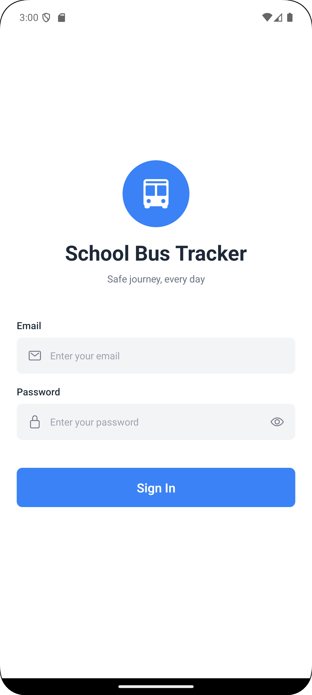
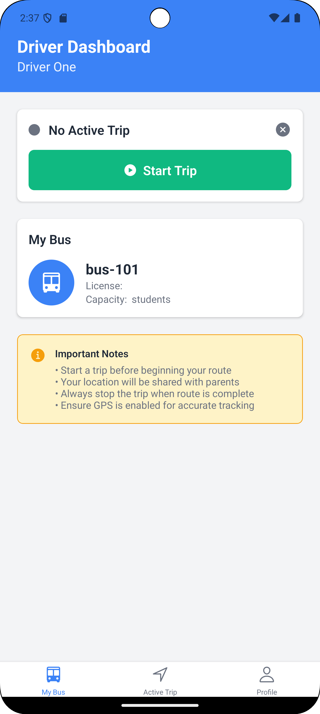
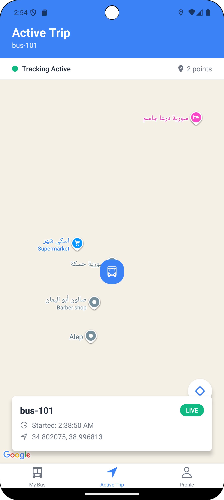
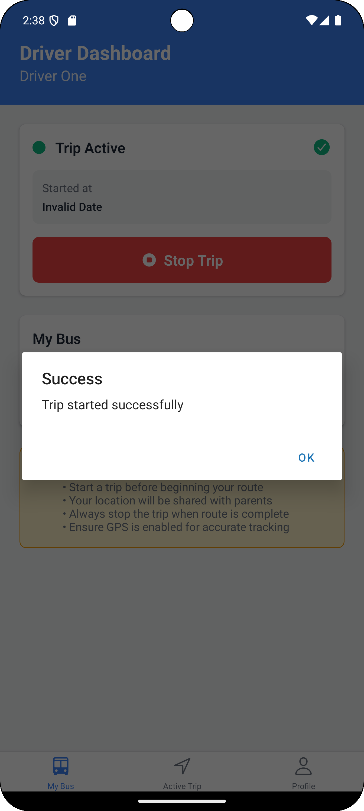
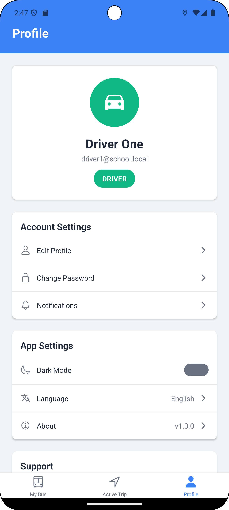
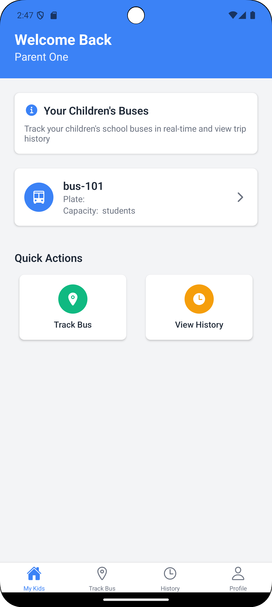
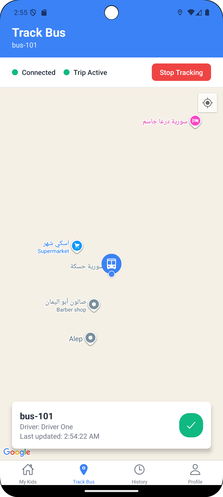
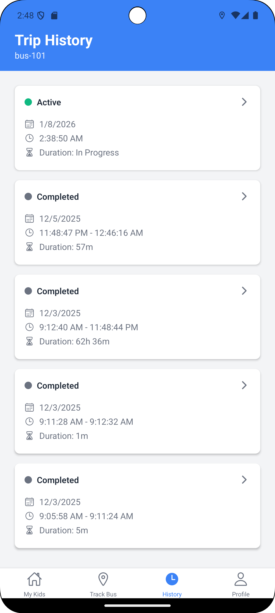
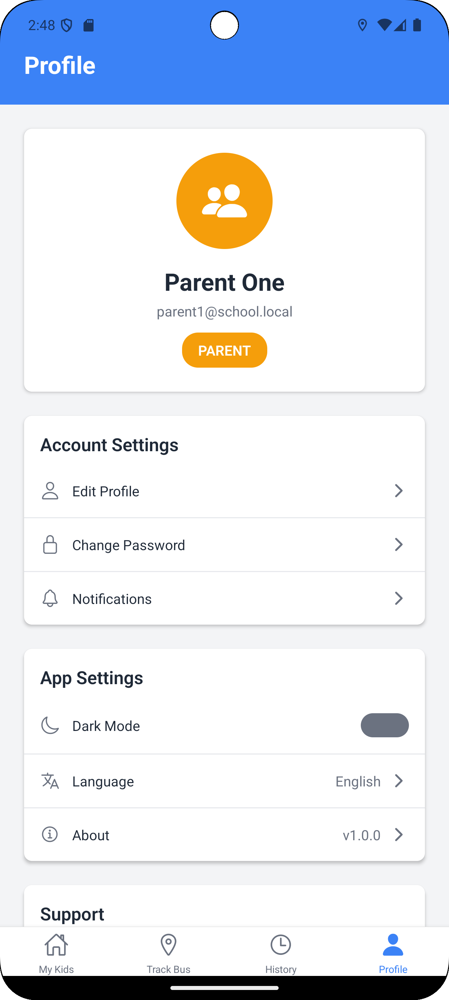

# School Bus Tracker

Real-time school bus tracking system for schools, drivers, and parents.

## Features

### For Drivers
- Start and stop trips with one tap
- Real-time location sharing with parents
- View assigned bus details
- Trip history tracking

### For Parents
- Track children's buses in real-time on map
- View trip history and duration
- Monitor bus status (active/completed)
- Receive updates when trips start/end

### For Admin
- Manage drivers, buses, and routes
- Assign drivers to buses
- Monitor all active trips
- View system-wide trip history

## Screenshots

### Login

### Driver Dashboard

### Active Trip

### Trip Started

### Driver Profile

### Parent Dashboard

### Track Bus

### Trip History

### Parent Profile

